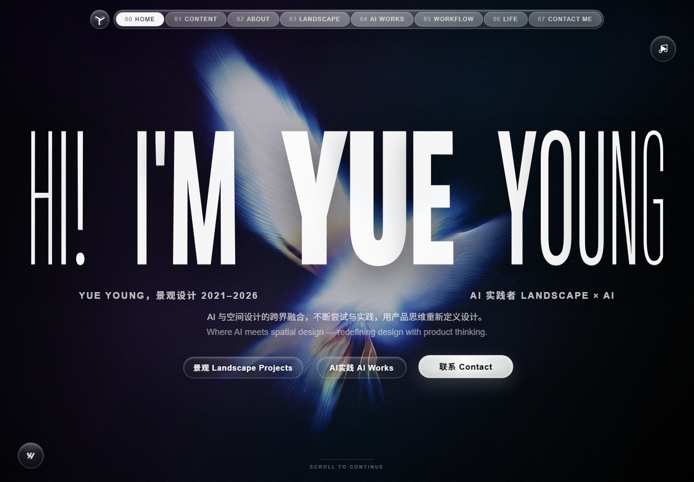

<h1 align="center">Young Yue｜AI 设计师 × AI 应用产品经理</h1>
<p align="center"><strong>Agent 工作流 · 人机协同 · AI 评测 · 专业创作工具</strong></p>
<p align="center"><a href="https://yueyoungaidesign.com/">完整在线作品集</a> · <a href="https://myaestheticarchive.com">Aesthetic Archive</a> · <a href="https://github.com/Young4ever33">GitHub</a></p>



## 关于我

我有五年景观与空间设计经验，经历 AECOM、顺景园林等四家公司和 30 余个落地项目，覆盖文旅、住宅、产业与生态修复，并完整参与“策划 → 概念 → 方案 → 施工图 → 落地”。现在我的主方向是 **AI 应用产品经理｜Agent 工作流与人机协同产品**，同时保留 AI 设计师的视觉判断与专业创作能力。

我关注的不只是“使用 AI 工具”或快速生成界面，而是如何把 AI 放进真实、复杂、需要负责的工作流：

- 从用户、场景和证据出发拆解问题，明确 AI 的介入点与人工接管点。
- 把模糊需求转化为可执行的 Agent workflow、数据结构、交互状态和验收标准。
- 通过 Prompt Engineering、LLM Evals 与受控实验判断输出是否真正可用。
- 对幻觉、假精度、隐私、权限和自动化过度建立明确产品边界。
- 使用 AI coding agent 协作完成原型、全栈实现、测试、部署、Release 与复盘。

```text
复杂任务 → AI 分析或执行 → 证据与状态可见 → 人工复核/接管 → 结果留存与迭代
```

## AI 设计师 × AI 产品经理

景观设计训练让我长期处理空间、视觉、工程、人文、政策和多方协作。读场地与读用户具有相似的方法：从动线、停留、冲突、约束与情绪中识别真实需求，再把问题翻译成可以沟通和交付的结构。

转向 AI 产品后，我把这种能力迁移到知识工作流和专业创作工具中：

| 设计训练 | AI 产品能力 |
|---|---|
| 从复杂场地中建立问题框架 | Product discovery、任务拆解与优先级 |
| 在多重约束下形成方案 | AI 介入点、失败边界与 Human-in-the-loop |
| 通过图纸、模型和现场验证 | 原型、Evals、Acceptance 与 Release 验证 |
| 组织视觉语言和材料系统 | 审美知识结构化、Prompt 与生成质量控制 |
| 推动方案从概念走向落地 | 从需求判断到可运行产品的完整闭环 |

## 已上线与可下载产品

### 01｜Aesthetic Archive｜AI 审美知识库

**在线产品：** [myaestheticarchive.com](https://myaestheticarchive.com) · **仓库：** [Aesthetic-Archive](https://github.com/Young4ever33/Aesthetic-Archive)

设计师可以保存成千上万张参考图，却常常丢失“为什么喜欢、为什么有效、下一次如何使用”的判断。Aesthetic Archive 把视觉参考转化为结构化审美卡片，记录设计元素、文化语境、材料、光线、色彩、构图、双语 Prompt、Negative Prompt、来源和权利信息。

```text
参考图 → AI 辅助分析 → 人工编辑 → 审美卡片 → Prompt / Collage → 审核后公开
```

产品包含 Public Plaza、My Archive、Prompt 复用、Collage Board、Reviewer/Admin 审核、系统消息和 Feedback 对话。私人研究默认私有，Provider Key 在服务端加密，公开卡片必须人工审核。

我负责产品定位、知识模型、四阶段工作流、Prompt 评测、隐私与审核边界、人工验收和上线决策。A-04 参数化建筑案例采用四维人工评分与单维门槛，保留中英文 Prompt 迭代、候选图和失败原因；这些结果明确标注为单案例受控评测，不包装成项目整体准确率。

### 02｜ZHONG 求职助手｜证据驱动的求职决策副驾驶

**下载：** [ZHONG v1.0.0](https://github.com/Young4ever33/ZHONG-Job-Assistant/releases/tag/v1.0.0) · **仓库：** [ZHONG-Job-Assistant](https://github.com/Young4ever33/ZHONG-Job-Assistant)

ZHONG 是 Chrome MV3 扩展，把求职拆成“候选人事实档案 → 当前页岗位池 → JD/简历双向证据 → 人工审核 → 沟通与追踪”。它不把关键词分数包装成录用概率，也不替用户自动投递。

扩展展示简历原文、JD 原文、匹配线索、能力缺口和信息完整度。信息不足时显示“待审核”；材料准备和发送严格分离；身份、资金、验证码等敏感请求进入阻断或复核。默认使用本地规则和浏览器存储，只有用户主动配置远程 Agent 时才可能向第三方服务发送选定内容。

这个项目验证了我对证据链、诚实 UI、隐私优先、人机协同和不可逆操作边界的产品判断。

### 03｜Pi Agent Desktop｜Windows Coding Agent 工作台

**下载：** [Pi Agent Desktop v0.1.0](https://github.com/Young4ever33/Pi-Agent-Desktop/releases/tag/v0.1.0) · **仓库：** [Pi-Agent-Desktop](https://github.com/Young4ever33/Pi-Agent-Desktop)

Pi Agent Desktop 为 Pi Coding Agent 和 Pi Web 增加 Windows 桌面工作流与分发层，集中处理启动、单实例、工作区、历史会话、后台任务、托盘、Progress Island、Cowart 画布、窗口恢复和安装包发布。

关键产品判断是拒绝不可验证的百分比进度：长任务只显示“空闲、执行中、完成”等真实状态。关闭主窗口后 runtime 可以在托盘继续运行；工作区和版本被固定，避免 `latest` 导致行为漂移。项目提供 NSIS 安装包、便携 ZIP 和 SHA-256 校验文件。

它证明了我不仅能定义 AI workflow，也能处理桌面交互、运行时治理、依赖钉版、打包分发和 Release 验证。

## 在线作品集中的五个 AI 产品实验

以下五个项目均可在 [yueyoungaidesign.com](https://yueyoungaidesign.com/) 打开完整产品说明与桌面/移动原型。它们不是一组同质化界面，而是对不同用户问题、内容结构和产品关系的独立探索。

### 01｜Aesthetic Archive｜审美档案与知识系统

从日常收藏切入，为视觉设计师、品牌策划、空间设计研究者和 AI 视觉创作者建立可持续扩展的参考库。产品把散落在相册、Pinterest、项目文件夹和聊天记录里的图片，转化为可以检索、阅读、跨域引用和复用 Prompt 的项目资产。

### 02｜Dream Raido｜个人博客音频库

面向写作者、研究型创作者和知识管理用户，把个人文章、链接、文档与笔记整理成可收听的声音档案。工作流覆盖资料导入、博客草稿、音色与语气配置、音频生成、档案管理和公开发布，并把摘要、时长、状态和来源边界绑定在同一条记录中。

### 03｜Lily｜女性全周期健康陪伴

围绕青春期、日常周期、备孕孕期产后和围绝经期建立连续的身体记录体验。产品不只记录经期日期，而是把症状、心情、睡眠、体温和生命阶段事件放进长期时间线；通过阶段问卷、趋势反馈和克制提醒，帮助用户理解变化，而不是制造健康焦虑。

### 04｜EveryThing Test｜社会议题内观测试库

把性别、世代、亚文化、城市与职业等社会议题转化为可回答、可反思的互动测试。产品从研究材料和具体场景生成题目，通过主题筛选、测试卡片、生成工作流和结果反馈，帮助用户理解自己的立场、偏见、身份和选择，而不是只提供娱乐化标签。

### 05｜Yywhy Papers｜个人论文与证据网络

面向研究型创作者、产品思考者和写作者，把事件、截图、链接、笔记与观点按事实、论点、背景、引用和问题分层，形成论文目录、文章详情、结构生成与证据网络。目标是让碎片材料发展为有出处、可继续追问的个人研究，而不是生成一篇无法追溯的长文。

## Agent Workflow 与 Codex Skills

### PPT HTML IDML Convert｜可编辑固定版式转换 Skill

**仓库：** [ppt-html-idml-convert](https://github.com/Young4ever33/ppt-html-idml-convert)

这是一个面向 Codex 的格式转换路由与执行 Skill。它先判断源格式、目标格式、页面尺寸和保真层级，再选择确定性脚本与桌面应用完成转换。当前已实现 HTML → 可编辑 IDML：通过 Chrome 提取渲染后的文本、图片、形状、边框和链接，再由 InDesign 重建页面对象并导出 IDML。

项目明确区分“可打开、可编辑版式、语义级往返”三个层级，并把 PDF 定位为 proof/export 或不可编辑置入源，避免承诺不存在的无损通用转换。

### AI PM-HR｜AI 产品求职工作流 Skill

**仓库：** [ai-pm-hr](https://github.com/Young4ever33/ai-pm-hr)

将 AI/AIGC 产品岗位求职拆成 JD 分析、简历证据匹配、定位调整、打招呼话术和面试准备。核心不是代替候选人编写经历，而是围绕真实证据组织表达，识别岗位要求与个人项目之间的可证明关系。

### Plan Council Execution｜Agent 任务治理工作流

**仓库：** [plan-council-execution](https://github.com/Young4ever33/plan-council-execution)

轻量级 Agent 任务治理流程，覆盖计划、Council review、执行和结果检查。它用于在长任务中建立阶段边界、评审节点和验收动作，减少 Agent 在错误方向上持续执行或仅凭自身声明判断“已完成”。

## 方法与能力

```text
AI Application Product Management · AI Workflow · Agent Product
Human-in-the-loop · Evidence-grounded UX · Honest AI
Prompt Engineering · LLM Evals · Controlled Experiments
Product Discovery · MVP Scoping · Prioritization · Release Validation
Visual Systems · Aesthetic Research · Design Workflow
```

技术实践包括 JavaScript、TypeScript、React、Next.js、Electron、Chrome MV3、Supabase、Postgres、RLS、Cloudflare Workers、Node.js、PowerShell、GitHub Actions 与产品部署。

## AI 协作说明

这些项目使用 AI coding agents 辅助实现。产品定位、用户问题、工作流边界、评测方法、人工接管规则、隐私取舍、失败复盘和发布决策由我负责。我不会把 AI 协作包装成个人独立手写全部代码，也不会用虚构用户量、准确率或“生产级”表述替代真实证据。

我的作品集重点是展示：如何判断 AI 应该做什么、不能做什么，如何让证据和失败状态可见，以及如何把这些判断落实为可以使用、检查和迭代的产品。

## 联系

- 完整作品集：<https://yueyoungaidesign.com/>
- GitHub：<https://github.com/Young4ever33>
- 所在地：杭州，中国
- 求职方向：AI 应用产品经理、AI 产品经理、Agent / Workflow 产品
