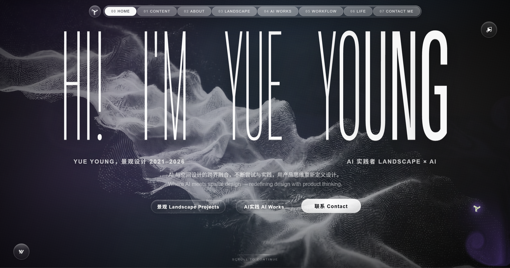
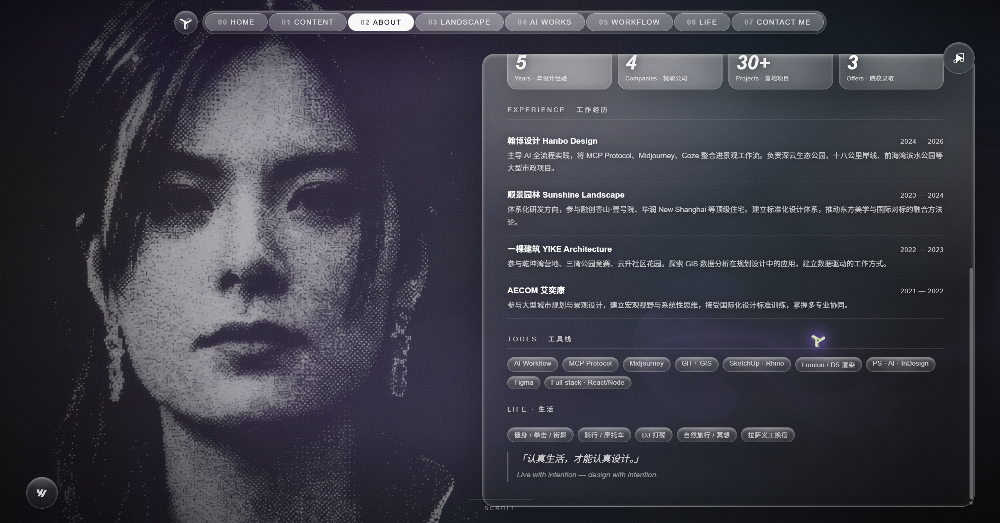
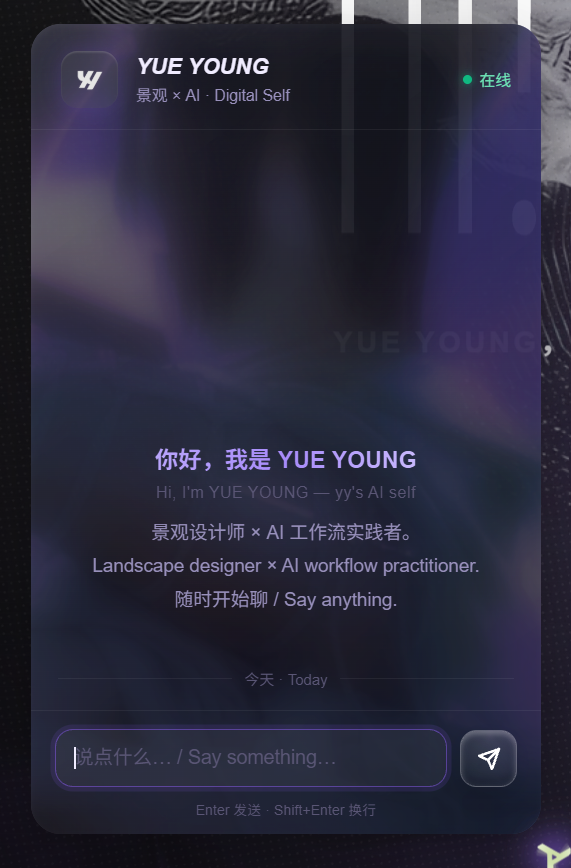
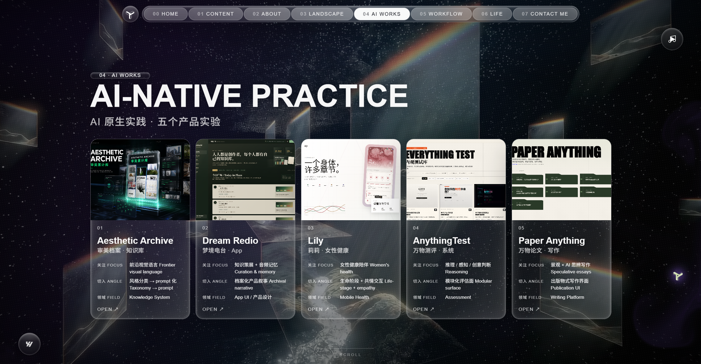
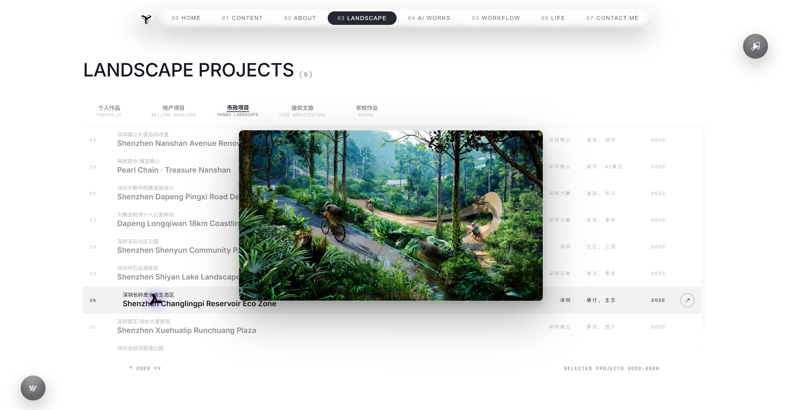
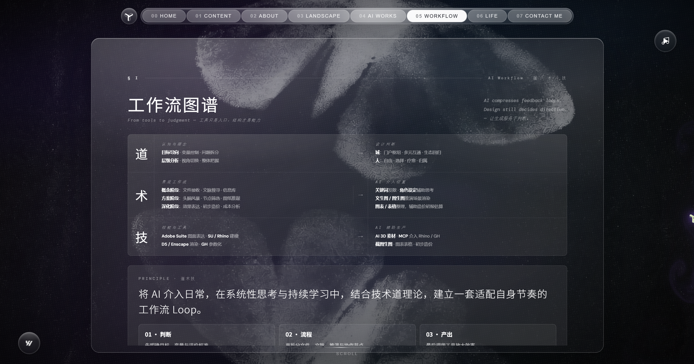
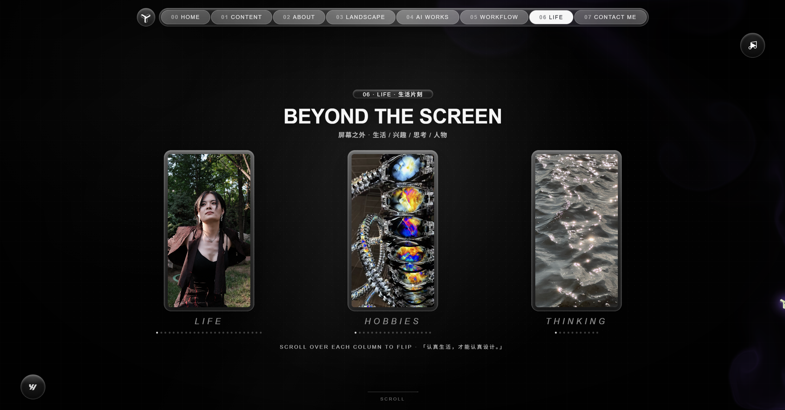
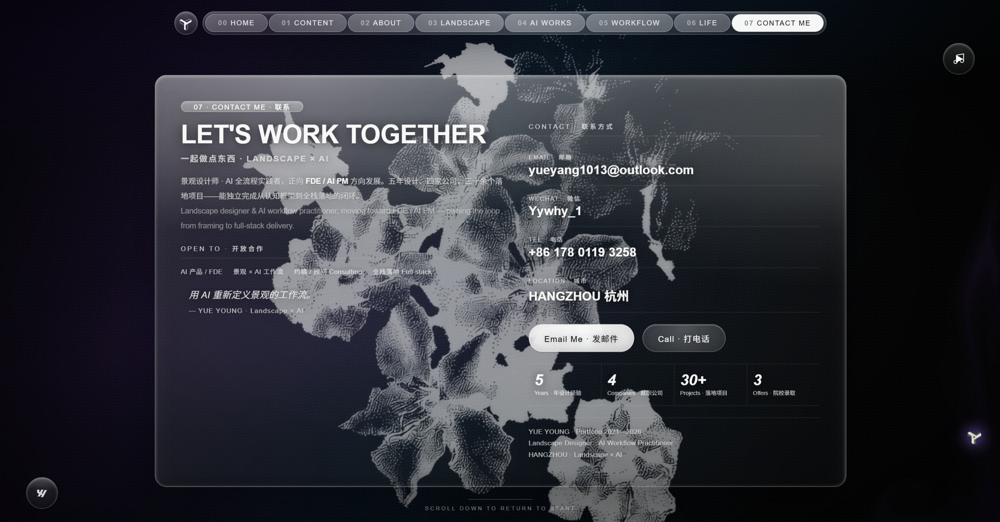

<p align="center"></p>

# Young Yue | AI Designer × AI Application Product Manager

[简体中文](README.zh-CN.md) · **English**

## Complete Online Portfolio

**[https://yueyoungaidesign.com/](https://yueyoungaidesign.com/)**

This repository contains the documentation and selected screenshots for Young Yue's online portfolio. The portfolio brings together landscape design, AI products, Agent workflows, and professional creative tools, along with project stories, working methods, and contact information.

> Visit the live portfolio at **[yueyoungaidesign.com](https://yueyoungaidesign.com/)**. This repository is primarily a presentation and reference space; it is not a standalone application package.

<p align="center"><a href="https://yueyoungaidesign.com/"></a></p>

<p align="center"><a href="https://yueyoungaidesign.com/">Open the online portfolio ↗</a> · <a href="https://myaestheticarchive.com">Open Aesthetic Archive</a> · <a href="https://github.com/Young4ever33">GitHub</a></p>

## About Me

I have five years of landscape and spatial-design experience across AECOM, Shunjing Landscape, and two other firms, with more than 30 built or delivered projects across cultural tourism, residential, industrial, and ecological-restoration work. I participated across the full process from planning and concept design through documentation and delivery. My current direction is **AI application product management, Agent workflows, and human-in-the-loop products**, while retaining the visual judgment and professional creative practice of an AI designer.

I am interested in more than using AI tools or generating interfaces quickly. I focus on putting AI into real, complex workflows that need clear responsibility:

- Break down problems from users, scenarios, and evidence, then define AI intervention and human handoff points.
- Turn ambiguous requirements into executable Agent workflows, data structures, interaction states, and acceptance criteria.
- Use Prompt Engineering, LLM Evals, and controlled experiments to determine whether an output is actually useful.
- Establish product boundaries around hallucination, false precision, privacy, permissions, and over-automation.
- Collaborate with AI coding agents across prototyping, full-stack implementation, testing, deployment, release, and review.

```text
Complex task → AI analysis or execution → visible evidence and state → human review / takeover → retained result and iteration
```

## AI Designer × AI Product Manager

Landscape design trained me to work across space, visual language, engineering, culture, policy, and multi-disciplinary collaboration. Reading a site and reading a user have a similar foundation: identify real needs through movement, pause, conflict, constraints, and emotion, then translate them into structures that can be communicated and delivered.

I now apply that approach to knowledge workflows and professional creative tools:

| Design training | AI product capability |
|---|---|
| Build a problem framework from a complex site | Product discovery, task decomposition, and prioritization |
| Develop a proposal under multiple constraints | AI intervention points, failure boundaries, and human-in-the-loop design |
| Validate through drawings, models, and site delivery | Prototyping, evals, acceptance, and release validation |
| Organize visual language and material systems | Structured aesthetic knowledge, Prompt design, and generation quality control |
| Move a concept toward implementation | A complete loop from product judgment to a runnable product |

<p align="center"></p>

The website also provides an AI digital-self entry point for exploring my background, project direction, and working methods through conversation.

<p align="center"></p>

## Shipped and Downloadable Products

### 01 | Aesthetic Archive | AI Aesthetic Knowledge System

**Live product:** [myaestheticarchive.com](https://myaestheticarchive.com) · **Repository:** [Aesthetic-Archive](https://github.com/Young4ever33/Aesthetic-Archive)

Designers can save thousands of references and still lose the judgment behind them: why a reference works, what to notice, and how to use it again. Aesthetic Archive turns visual references into structured aesthetic cards covering design elements, cultural context, materials, light, color, composition, bilingual Prompts, Negative Prompts, sources, and rights information.

```text
Reference → AI-assisted analysis → human editing → aesthetic card → Prompt / Collage → human review before publication
```

The product includes Public Plaza, My Archive, Prompt reuse, Collage Board, reviewer/admin review, system messages, and threaded Feedback conversations. Private research is private by default, Provider Keys are encrypted server-side, and public cards require human review.

I owned the product positioning, knowledge model, four-stage workflow, Prompt evaluation, privacy and review boundaries, human acceptance, and release decisions. The A-04 parametric-architecture case uses four human-rated dimensions with a single-dimension threshold. Chinese and English Prompt iterations, candidate images, and failure causes are retained. These results are explicitly marked as a controlled evaluation for one case, not as project-wide accuracy.

### 02 | ZHONG Job Assistant | Evidence-Driven Job Search Copilot

**Download:** [ZHONG v1.0.0](https://github.com/Young4ever33/ZHONG-Job-Assistant/releases/tag/v1.0.0) · **Repository:** [ZHONG-Job-Assistant](https://github.com/Young4ever33/ZHONG-Job-Assistant)

ZHONG is a Chrome MV3 extension that structures job search as candidate fact record → current-page job pool → two-way JD/resume evidence → human review → communication and follow-up. It does not turn keyword scores into hiring probabilities or submit applications on the user's behalf.

The extension shows resume text, JD text, matching evidence, capability gaps, and information completeness. Missing information is marked for review; preparation and sending are separate actions; requests involving identity, money, or verification codes are blocked or escalated. It uses local rules and browser storage by default. Selected content can reach a third-party Agent only when the user explicitly configures one.

This project tests product judgment around evidence chains, honest UI, privacy-first design, human collaboration, and irreversible-action boundaries.

### 03 | Pi Agent Desktop | Windows Coding Agent Workbench

**Download:** [Pi Agent Desktop v0.1.0](https://github.com/Young4ever33/Pi-Agent-Desktop/releases/tag/v0.1.0) · **Repository:** [Pi-Agent-Desktop](https://github.com/Young4ever33/Pi-Agent-Desktop)

Pi Agent Desktop adds a Windows desktop workflow and distribution layer around Pi Coding Agent and Pi Web. It handles startup, single-instance behavior, workspaces, session history, background tasks, tray behavior, Progress Island, Cowart canvas, window recovery, and installer releases.

The key product decision is to reject unverifiable percentage progress. Long-running tasks show observable states such as idle, executing, and done. Closing the main window lets the runtime continue in the tray; workspace and dependency versions are pinned to avoid behavioral drift from `latest`. The project ships an NSIS installer, portable ZIP, and SHA-256 checksums.

It demonstrates that I can define AI workflows and also work through desktop interaction, runtime governance, dependency pinning, packaging, distribution, and release validation.

## Other AI Product Experiments in the Online Portfolio

The projects below can be explored through the [complete online portfolio](https://yueyoungaidesign.com/), including full product narratives and desktop/mobile prototypes. Aesthetic Archive is already documented above under shipped products and is intentionally not repeated here.

### 01 | Dream Raido | Personal Blog Audio Library

For writers, research-oriented creators, and knowledge-management users, Dream Raido turns articles, links, documents, and notes into a listenable audio archive. The workflow covers source import, blog drafts, voice and tone configuration, audio generation, archive management, and publication, while keeping summaries, duration, status, and source boundaries together in one record.

### 02 | Lily | Full-Cycle Women's Health Companion

Lily creates a continuous body-recording experience across adolescence, everyday cycles, conception, pregnancy, postpartum recovery, and perimenopause. It goes beyond period dates by placing symptoms, mood, sleep, temperature, and life-stage events on a long-term timeline. Stage-specific questionnaires, trend feedback, and restrained reminders help users understand change without manufacturing health anxiety.

### 03 | EveryThing Test | Social-Issue Reflection Library

EveryThing Test turns social topics such as gender, generation, subculture, city, and profession into answerable, reflective interactive tests. It generates questions from research material and concrete scenarios, then uses topic filters, test cards, a generation workflow, and result feedback to help users examine positions, bias, identity, and choices rather than assigning entertainment-only labels.

### 04 | Yywhy Papers | Personal Papers and Evidence Network

For research-oriented creators, product thinkers, and writers, Yywhy Papers organizes events, screenshots, links, notes, and viewpoints into facts, claims, context, citations, and open questions. It forms a paper index, article detail pages, structure generation, and an evidence network so fragments can become traceable research that can be questioned further rather than an untraceable long-form generation.

<p align="center"></p>

## Landscape Design and AI Workflows

The complete website retains the landscape projects, professional background, and the Landscape × AI transition narrative. Landscape design is inherently cross-disciplinary: one proposal must handle ecology, engineering, culture, policy, spatial experience, and multi-disciplinary coordination. AI can connect research, generation, validation, and communication into a faster loop.

<p align="center"></p>

## Agent Workflows and Codex Skills

### PPT HTML IDML Convert | Editable Fixed-Layout Conversion Skill

**Repository:** [ppt-html-idml-convert](https://github.com/Young4ever33/ppt-html-idml-convert)

This is a Codex-oriented routing and execution Skill for format conversion. It first identifies source format, target format, page dimensions, and fidelity tier, then selects deterministic scripts and desktop applications. The implemented path is HTML → editable IDML: Chrome extracts rendered text, images, shapes, borders, and links, and InDesign rebuilds page objects before exporting IDML.

The project distinguishes the tiers of opening a file, editing its layout, and semantic round-tripping. PDF is treated as proof/export or an uneditable placed source, avoiding claims of universal lossless conversion that the implementation cannot support.

### AI PM-HR | AI Product Job-Search Workflow Skill

**Repository:** [ai-pm-hr](https://github.com/Young4ever33/ai-pm-hr)

This workflow decomposes AI/AIGC product job search into JD analysis, resume evidence matching, positioning, outreach language, and interview preparation. It does not invent experience; it organizes real evidence and identifies demonstrable relationships between job requirements and personal projects.

### Plan Council Execution | Agent Task-Governance Workflow

**Repository:** [plan-council-execution](https://github.com/Young4ever33/plan-council-execution)

A lightweight Agent task-governance process covering planning, Council review, execution, and result checking. It establishes phase boundaries, review points, and acceptance actions for long tasks, reducing the risk of an Agent continuing in the wrong direction or declaring completion without evidence.

<p align="center"></p>

## Methods and Capabilities

```text
AI Application Product Management · AI Workflow · Agent Product
Human-in-the-loop · Evidence-grounded UX · Honest AI
Prompt Engineering · LLM Evals · Controlled Experiments
Product Discovery · MVP Scoping · Prioritization · Release Validation
Visual Systems · Aesthetic Research · Design Workflow
```

Technical practice includes JavaScript, TypeScript, React, Next.js, Electron, Chrome MV3, Supabase, Postgres, RLS, Cloudflare Workers, Node.js, PowerShell, GitHub Actions, and product deployment.

## AI Collaboration Note

These projects were built with assistance from AI coding agents. I am responsible for product positioning, user problems, workflow boundaries, evaluation methods, human handoff rules, privacy trade-offs, failure reviews, and release decisions. I do not present AI collaboration as personally handwriting every line of code, and I do not replace real evidence with invented user counts, accuracy figures, or claims of production maturity.

The portfolio is intended to show how I decide what AI should do, what it should not do, how evidence and failure states remain visible, and how those decisions become products that can be used, checked, and iterated.

## Beyond the Screen

The complete website also retains life, interests, and personal observations. Professional judgment comes not only from tools and screens, but also from lived experience, spatial awareness, and sustained observation.

<p align="center"></p>

## Contact

- Complete portfolio: <https://yueyoungaidesign.com/>
- GitHub: <https://github.com/Young4ever33>
- Location: Hangzhou, China
- Target roles: AI Application Product Manager, AI Product Manager, Agent / Workflow Product

<p align="center"></p>

<p align="center"><a href="https://yueyoungaidesign.com/">Enter the complete website to view all pages and projects ↗</a></p>
